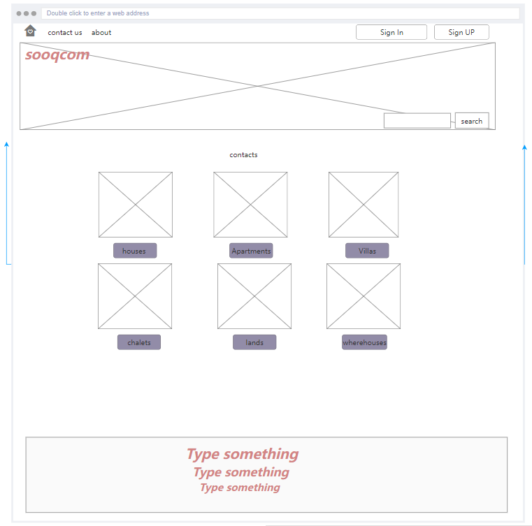
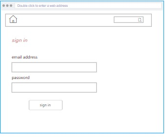
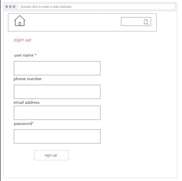
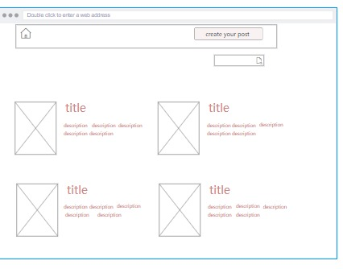
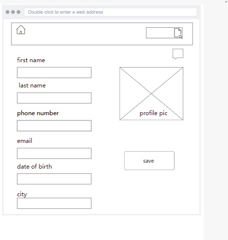
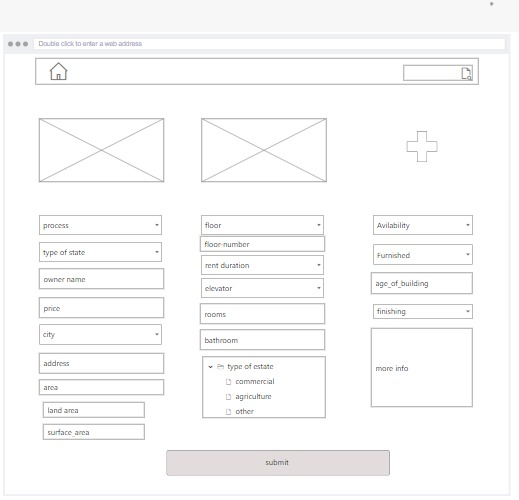
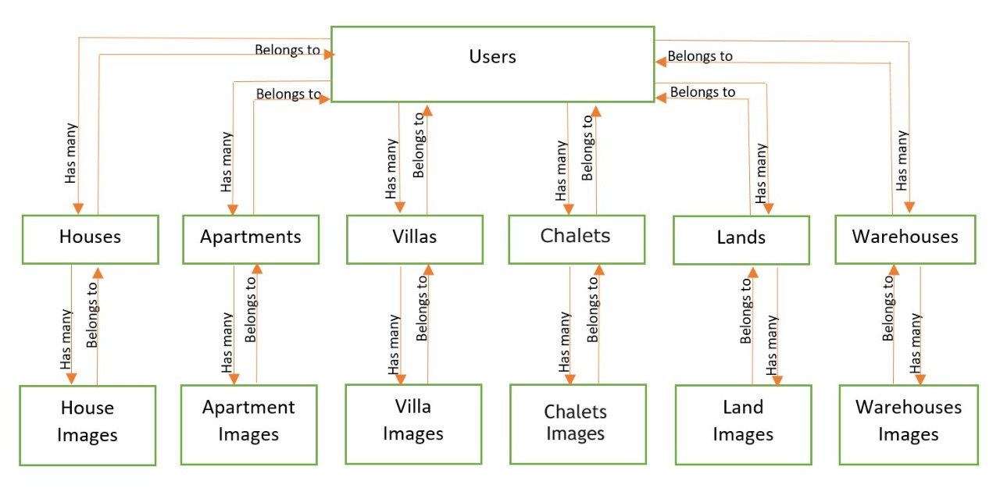
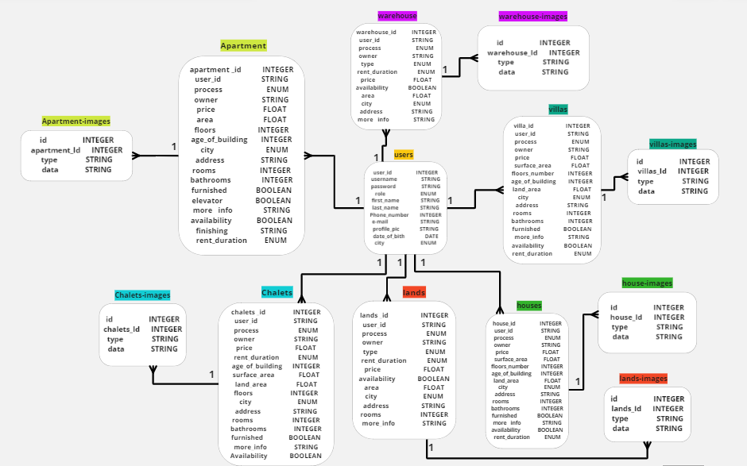
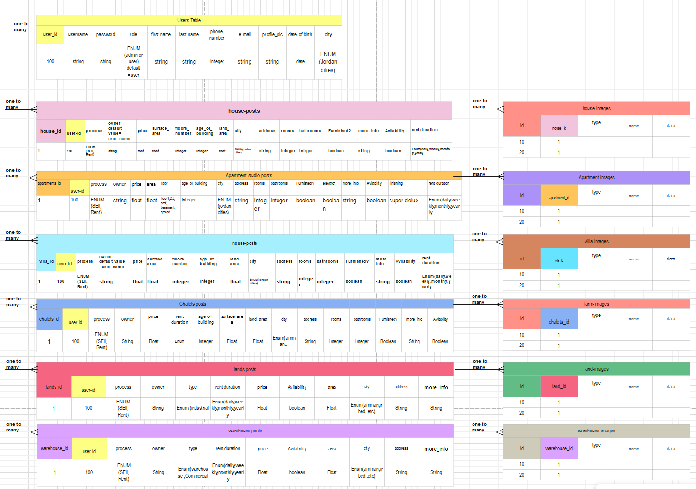

# AkarCom

### GitTop Group :

1- Mohammad Alshraideh (team leader)

2- Esam Ankir (team member)

3- Hadeel Saleh (team member)

4- Mohammed Aldahleh (team member)

5- Islam Rwashdeh (team member)

### project idea : 
 
 `AkarCom` is webSite that allows users to market `real estate` such as houses, apartments , lands and ...etc . 
 This website contains users real estate ads created within the website .

### wireframe : 
[wire frame link](https://rp.mockplus.com/run/cwwT2JOHig/VnziwrSIn1?cps=expand&rps=expand&nav=1&ha=0&la=0&fc=0&out=1&rt=1)

### user sories : 

1-visitor : 
 as a visitor (not registred ), i want the ability to read the content of the website (posts) 

2-regular user : 

as user (registred user ) , i want the ability to `create` , `update` and `delete` my own posts ,
contact with other users and read the content of the website (posts)

3- admin : 

as an admin : i will have the ability to act as aregular user and  i will have the ability to `control` every single part of the website such as : `delete` any `user` and `post`

### Software Requirements :

Functional Requirements:

1. A visitor can read all posts on the website home page.
2. A visitor can search all of the posts in the website App.
3. A user (signed in) has the ability to do all things that visitor can.
4. A user can create posts.
5. A user can update and delete their posts.
6. A user can contact with any user on the website (live chat).
7. A user can update their profile information.
8. An admin has the ability to do all things that visitor and users can do.
9. An admin can create and delete user accounts.
10. An admin can delete any posts on the website.

Non-Functional Requirements : 

1- Security  :  create token when the user registred and will hash his password 

2- Usability : true

3-performance  : high 

4-scalacility : true

5-Reliability : true

6-Maintainability : true

7- Serviceability : true

8-Utility : true

Manageability : true

### Domain Modeling

### Using a Database? Make an Database Schema Diagram

