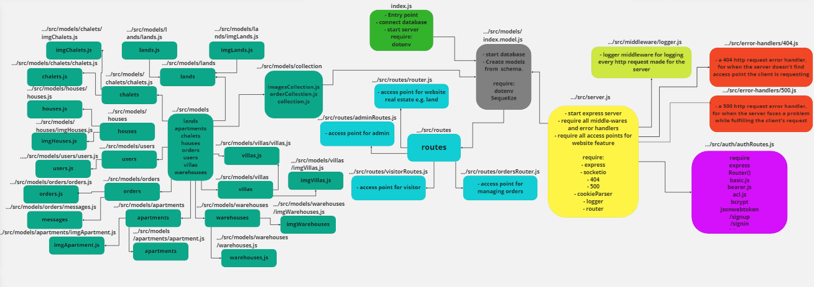
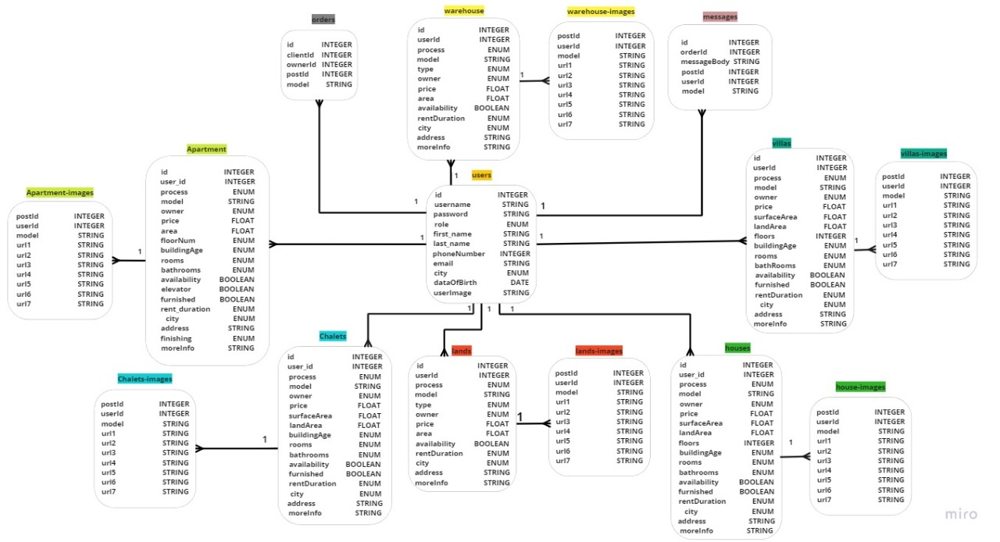
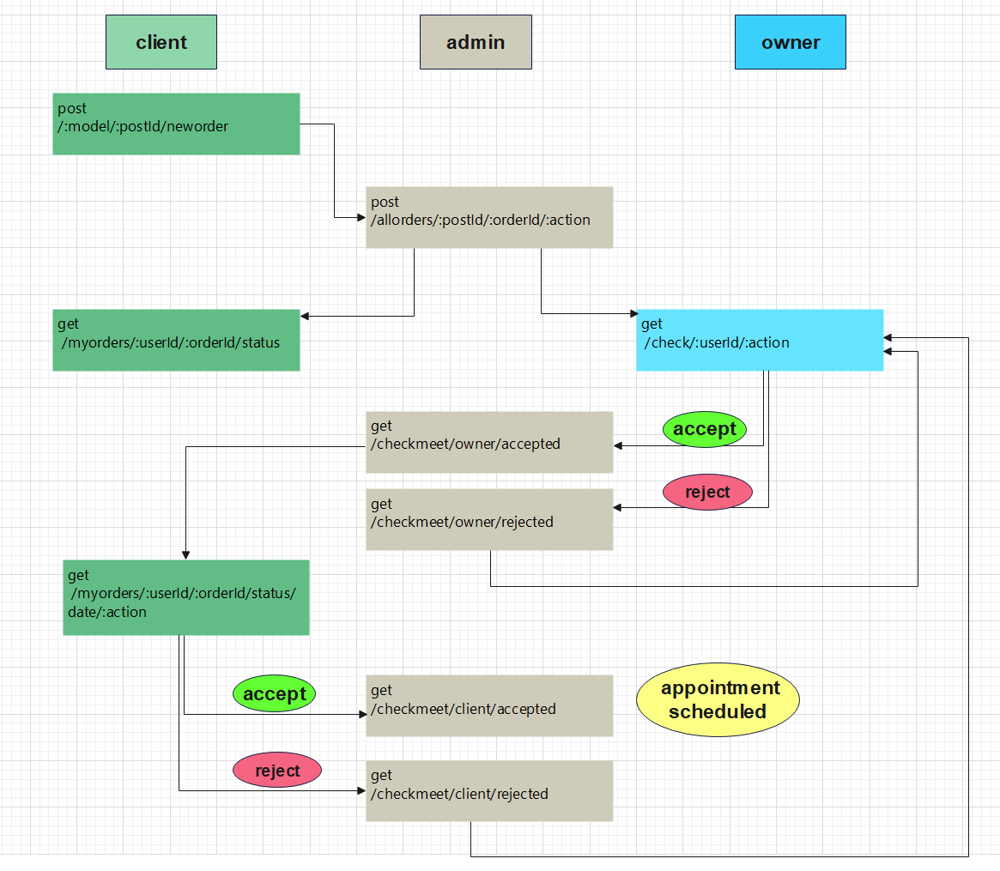

#  AkarCom

## _Group-3, mid-project_

[GitHub](https://github.com/Git-Top-group/SooqCom/tree/staging)

[Heroku](https://akarcom-mid-project.herokuapp.com) 

 
# Fashionable 

## ✨Team members✨

- Mohammad Alshraideh  (Team Leader)
  
- Esam Ankir

- Hadeel Saleh 
  
- Mohammed Aldahleh

- Islam Rwashdeh 


---

## Configuration

Configure the root of your repository with the following files and directories. Thoughfully name and organize any aditional configuration or module files.

-   **README.md** - contains documentation
-   **.env** - contains env variables (should be git ignored)
-   **.gitignore** - contains a  `.gitignore` file
<!-- -   **.eslintrc** - contains the course linter configuratoin -->
<!-- -   **.eslintignore** - contains the course linter ignore configuration -->
-   **package.json** - contains npm package config
    -   create a `test` script for running tests
    -   create a `start` script for running your server
-   **index.js** - the entry point for your application
-   **src/** - contains your core application files and folders
-   **\_\_test\_\_/** - contains unit tests

---

## Authrization

-  Visitor  - READ

-  User - READ/CREATE/UPDATE/DELETE (limmeted)

-  Admin - READ/CREATE/UPDATE/DELETE 

---

## Dependencies

-   express
  
-   sequelize
  
-   socket.io
  
-   base-64

-   bcrypt

-   dotenv

-   jest

-   jsonwebtoken

-   pg

-   http

-   cookie-parser

-   nodemon 
  
-   path
   
-   sqlite3


---

## Auth Routes

| method      |                      link           |   Description            |
| ----------- | ------------------------------------|--------------------------|
|    POST     |  /signup                           | Signup       |
|    POST     |  /signin                           |     Signin    |
|    GET   |   /signout                         |      to signout|


## Visitor  Routes

| method      |                    link   |   Description                        |
| ----------- | --------------------------|--------------------------------------|
|    GET     |  /:model               |    Get specific model  posts|
|    GET      |  /:model/:postId           |    Get specific posts  |
|    GET      |  /:model/:postId/:modelImages                |    Get specific post images         |
|  POST    |   /hi/search/:model/:term'       |   search about specific data       |
|  GET     |  /:model/:process/:city/:owner/:availability/:buildingAge/:furnished/:rooms/:bathRooms/:rentDuration/:floors/:priceFrom/:priceTo             |  Filter one or more at the same time (visitor)            |


## Users  Routes

| method      |                    link   |   Description                        |
| ----------- | --------------------------|--------------------------------------|
|    GET     |         /dashboard/:userId/main      |    Open user dashboard |
|    GET      |  /dashboard/:userId/:model          |   Get all posts related with specific model  |
|    GET      | /dashboard/:userId/:model/:postId               |    Get specifi  posts from  specifi  model     |
|  GET |  /dashboard/:userId/:model/:postId/:modelImages         |  Get specific post images        |
|  POST     |  /newpost/:userId/:model            | Create posts       |
|  POST      | /newpost/:userId/:model/:postId/:modelImages   |  Create post images          |
|GET       |  /dashboard/:userId/:model/:postId             |  open specific post in user dashboard           |
|PUT| /dashboard/:userId/:model/:postId       |  Update post from dashboard         |
|PUT|  /dashboard/:userId/:model/:postId/:modelImages         |  Update post images from dsashboard       |
|DELETE |  /dashboard/:userId/:model/:postId             | Delete posts  from dashboard         |
|DELETE |  /dashboard/:userId/:model/:postId/:modelImages          | Delete posts images from dashboard         |
|GET |   /user/profile/:userId         |  Open users personal profile       |

## Admin Routes

| method      |                    link   |   Description                        |
| ----------- | --------------------------|--------------------------------------|
|   POST    |  admin/signin           |   sign in for admin    |
| GET       | /users        |  Get all users for admin        |
|    PUT     |   /user/profile/:id/update                       |    Update user record |
|  DELETE    |   /delete/:username         | Delete user         |
|   DELETE|  /:model/:userId/:postId          |  Delete any post for any user          |


## Order Routes

| method      |                    link   |   Description                        |
| ----------- | --------------------------|--------------------------------------|
|    POST     |  /:model/:postId/neworder           |    Create new Order  |
|    GET      |   /allorders           |    Get all Order   |
|    GET      |  /allorders/:postId"             |    Get specific post orders          |
|  GET   |  /allorders/:postId/:orderId           |   Get specific order on specific post        |
|  POST     |  /allorders/:postId/:orderId/:action        |  send a message to owner            |
|     GET   |  /myorders/:userId      | enable user to see all his/her orders       |
|     GET   |  /myorders/:userId/:orderId     |enable  user to see specific order       |
|     GET   |  /myorders/:userId/:orderId/status    |  check  ordar status
|     GET   |  /check/:userId/:action  |  admin can check if the owner accept the order or not      |
|     GET   |  /myorders/:userId/:orderId/status/date  |   client can check meeting date  |
|     GET   |  /checkmeet/owner/accepted  |  check if meeting accepted |
|     GET   |  /checkmeet/owner/ rejected|  check if meeting rejected|


## UML

 

##  ER diagram

 

##  Appointment an order

 

## Installation

 AkarCom requires [Node.js](https://nodejs.org/) v14+ to run.

Install the dependencies and devDependencies and start the server.

```sh
cd AkarCom
npm i
npm start
```

For production environments...

```sh
npm install --production
NODE_ENV=production node index
```

## License

MIT
