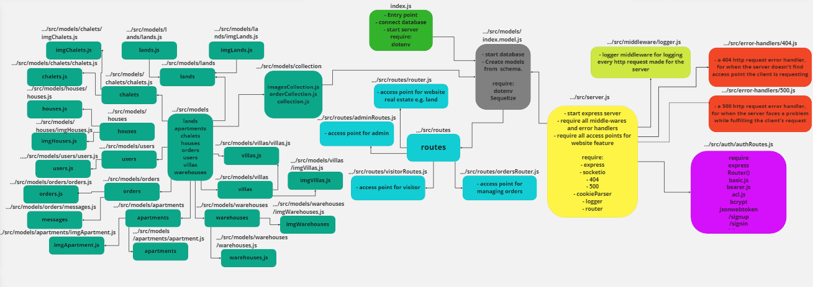
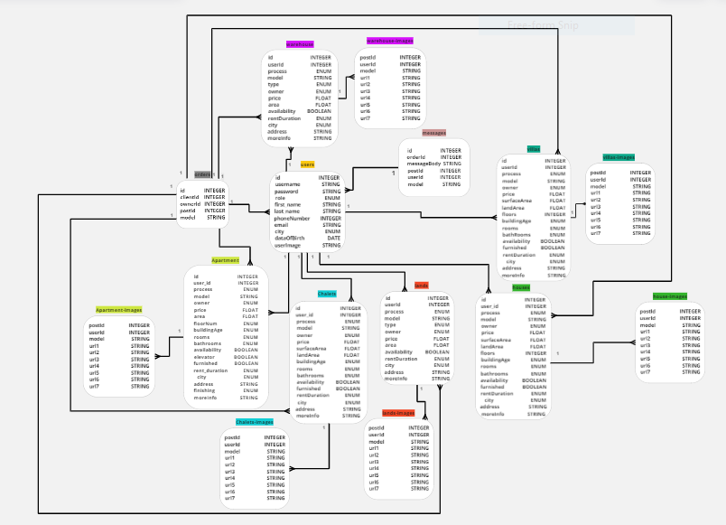

#  e-commerce

## _Group-1, mid-project_

[GitHub](https://github.com/TOKILS/e-commerce)

[Heroku](https://mid-project-01.herokuapp.com/)

 
# Fashionable 

## ✨Team members✨

- Khaled Tahat (Team Leader).
- Laith Hayajneh.
- Suhaib Ersan.
- Tariq Abu-Laban.
- Ibrahim Sarayrah.
- Omar Al-azaizah.

---

## Configuration

Configure the root of your repository with the following files and directories. Thoughfully name and organize any aditional configuration or module files.

-   **README.md** - contains documentation
-   **.env** - contains env variables (should be git ignored)
-   **.gitignore** - contains a  `.gitignore` file
-   **.eslintrc** - contains the course linter configuratoin
-   **.eslintignore** - contains the course linter ignore configuration
-   **package.json** - contains npm package config
    -   create a `test` script for running tests
    -   create a `start` script for running your server
-   **index.js** - the entry point for your application
-   **src/** - contains your core application files and folders
-   **\_\_test\_\_/** - contains unit tests

---

## Authrization

-   users - READ

-   vendor - READ/CREATE/UPDATE

-   admin - READ/CREATE/UPDATE/DELETE

---

## Dependencies

-   base-64

-   bcrypt

-   cors

-   dotenv

-   express

-   jest

-   jsonwebtoken

-   pg

-   supertest

-   sequelize

-   http

-   ejs

-   socket.io

-   socket.io-client

-   uuid

---

## Auth Routes

| method      |                      link           |   Description            |
| ----------- | ------------------------------------|--------------------------|
|    POST     |  /signup                           | Signup       |
|    POST     |  /signin                           |     Signin    |
|    PUT     |  /updateAccount                              |    Update user recored |
|    DELETE      |  /deleteAccount                           |Delete user recored|
|    GET   |  /users                           |      Get all users for admin|
|    GET   |  /secret                          |      Get The token and description for users|


## Category Routes

| method      |                    link   |   Description                        |
| ----------- | --------------------------|--------------------------------------|
|    POST     |  /api/v2/Category                |    Create new Category  |
|    GET      |  /api/v2/Category:id             |    Get specific category   |
|    GET      | /api/v2/Category                 |    Get all category           |
|    DELETE   |  /api/v2/Category:id             |   Delete specific category         |
|   PUT       |  /api/v2/Category:id              |  update specific category            |
|   PATCH       |  /api/v2/Category:id              |  update specific category            |

## Type Routes

| method      |                    link   |   Description                        |
| ----------- | --------------------------|--------------------------------------|
|    POST     |  /api/v2/Type              |    Create new Type  |
|    GET      |  /api/v2/Type:id             |    Get specific Type   |
|    GET      | /api/v2/Type                 |    Get all Type           |
|    DELETE   |  /api/v2/Type:id             |   Delete specific Type         |
|   PUT       |  /api/v2/Type:id              |  update specific Type            |
|   PATCH       |  /api/v2/Type:id              |  update specific Type            |

## Product Routes

| method      |                    link   |   Description                        |
| ----------- | --------------------------|--------------------------------------|
|    POST     |  /api/v2/Product              |    Create new Product  |
|    GET      |  /api/v2/Product:id             |    Get specific Product   |
|    GET      | /api/v2/Product                 |    Get all Product           |
|    DELETE   |  /api/v2/Product:id             |   Delete specific Product         |
|   PUT       |  /api/v2/Product:id              |  update specific Product            |
|   PATCH       |  /api/v2/Product:id              |  update specific Product            |

## Color Routes

| method      |                    link   |   Description                        |
| ----------- | --------------------------|--------------------------------------|
|    POST     |  /api/v2/Color              |    Create new Color  |
|    GET      |  /api/v2/Color:id             |    Get specific Color   |
|    GET      | /api/v2/Color                 |    Get all Color           |
|    DELETE   |  /api/v2/Color:id             |   Delete specific Color         |
|   PUT       |  /api/v2/Color:id              |  update specific Color            |
|   PATCH       |  /api/v2/Color:id              |  update specific Color            |

## Size Routes

| method      |                    link   |   Description                        |
| ----------- | --------------------------|--------------------------------------|
|    POST     |  /api/v2/Size              |    Create new Size  |
|    GET      |  /api/v2/Size:id             |    Get specific Size   |
|    GET      | /api/v2/Size                 |    Get all Size           |
|    DELETE   |  /api/v2/Size:id             |   Delete specific Size         |
|   PUT       |  /api/v2/Size:id              |  update specific Size            |
|   PATCH       |  /api/v2/Size:id              |  update specific Size            |

## Image Routes

| method      |                    link   |   Description                        |
| ----------- | --------------------------|--------------------------------------|
|    POST     |  /api/v2/Image              |    Create new Image  |
|    GET      |  /api/v2/Image:id             |    Get specific Image   |
|    GET      | /api/v2/Image                 |    Get all Image           |
|    DELETE   |  /api/v2/Image:id             |   Delete specific Image         |
|   PUT       |  /api/v2/Image:id              |  update specific Image            |
|   PATCH       |  /api/v2/Image:id              |  update specific Image            |

## Reviews Routes

| method      |                    link   |   Description                        |
| ----------- | --------------------------|--------------------------------------|
|    POST     |  /api/v2/Reviews              |    Create new Reviews  |
|    GET      |  /api/v2/Reviews:id             |    Get specific Reviews   |
|    GET      | /api/v2/Reviews                 |    Get all Reviews           |
|    DELETE   |  /api/v2/Reviews:id             |   Delete specific Reviews         |
|   PUT       |  /api/v2/Reviews:id              |  update specific Reviews            |
|   PATCH       |  /api/v2/Reviews:id              |  update specific Reviews            |

## Cart Routes

| method      |                    link   |   Description                        |
| ----------- | --------------------------|--------------------------------------|
|    POST     |  /api/v2/Cart              |    Create new Cart  |
|    GET      |  /api/v2/Cart:id             |    Get specific Cart   |
|    GET      | /api/v2/Cart                 |    Get all Cart           |
|    DELETE   |  /api/v2/Cart:id             |   Delete specific Cart         |
|   PUT       |  /api/v2/Cart:id              |  update specific Cart            |
|   PATCH       |  /api/v2/Cart:id              |  update specific Cart            |

## Address Routes

| method      |                    link   |   Description                        |
| ----------- | --------------------------|--------------------------------------|
|    POST     |  /api/v2/Address              |    Create new Address  |
|    GET      |  /api/v2/Address:id             |    Get specific Address   |
|    GET      | /api/v2/Address                 |    Get all Address           |
|    DELETE   |  /api/v2/Address:id             |   Delete specific Address         |
|   PUT       |  /api/v2/Address:id              |  update specific Address            |
|   PATCH       |  /api/v2/Address:id              |  update specific Address            |

## Order Routes

| method      |                    link   |   Description                        |
| ----------- | --------------------------|--------------------------------------|
|    POST     |  /api/v2/Order              |    Create new Order  |
|    GET      |  /api/v2/Order:id             |    Get specific Order   |
|    GET      | /api/v2/Order                 |    Get all Order           |
|    DELETE   |  /api/v2/Order:id             |   Delete specific Order         |
|   PUT       |  /api/v2/Order:id              |  update specific Order            |
|   PATCH       |  /api/v2/Order:id              |  update specific Order            |

## OrderDetails Routes

| method      |                    link   |   Description                        |
| ----------- | --------------------------|--------------------------------------|
|    POST     |  /api/v2/OrderDetails              |    Create new OrderDetails  |
|    GET      |  /api/v2/OrderDetails:id             |    Get specific OrderDetails   |
|    GET      | /api/v2/OrderDetails                 |    Get all OrderDetails           |
|    DELETE   |  /api/v2/OrderDetails:id             |   Delete specific OrderDetails         |
|   PUT       |  /api/v2/OrderDetails:id              |  update specific OrderDetails            |
|   PATCH       |  /api/v2/OrderDetails:id              |  update specific OrderDetails            |

## Wishlist Routes

| method      |                    link   |   Description                        |
| ----------- | --------------------------|--------------------------------------|
|    POST     |  /api/v2/Wishlist              |    Create new Wishlist  |
|    GET      |  /api/v2/Wishlist:id             |    Get specific Wishlist   |
|    GET      | /api/v2/Wishlist                 |    Get all Wishlist           |
|    DELETE   |  /api/v2/Wishlist:id             |   Delete specific Wishlist         |
|   PUT       |  /api/v2/Wishlist:id              |  update specific Wishlist            |
|   PATCH       |  /api/v2/Wishlist:id              |  update specific Wishlist            |

## Extra Routes

| method      |                      link           |   Description              |
| ----------- | ------------------------------------|----------------------------|
|    GET      |  /api/v3/reviews:id                              |  Get specific reviews  |
|    GET      |  /api/v3/reviewsInfo:id                          | Get specific reviewsInfo|
|    GET      |  /api/v3/cartProducts:id                         |    Get specific cartProducts |
|    GET      |  /api/v3/cartProductsInfo:id                              |  Get specific cartProductsInfo  |
|    GET      |  /api/v3/wishlistProducts:id                          | Get specific wishlistProducts|
|    GET      |  /api/v3/wishlistProductsInfo:id                         |    Get specific wishlistProductsInfo |
|    GET      |  /api/v3/orderProducts:id                              |  Get specific orderProducts  |
|    GET      |  /api/v3/orderProductsInfo:id                          | Get specific orderProductsInfo|
|    GET      |  /api/v3/address:id                         |    Get specific address |
|    GET      |  /api/v3/type:id                         |    Get specific type |
|    GET      |  /api/v3/category:id                         |    Get specific category |

## UML

 

##  ER diagram

 


## Installation

e-commerce requires [Node.js](https://nodejs.org/) v14+ to run.

Install the dependencies and devDependencies and start the server.

```sh
cd e-commerce
npm i
npm start
```

For production environments...

```sh
npm install --production
NODE_ENV=production node index
```

## License

MIT

**Free Software, Hell Yeah!**